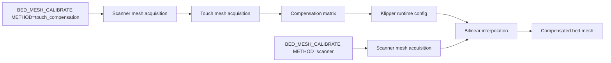

# Scanner Touch Mesh Compensation

Feature Name: scanner-touch-mesh-compensation
Updated: 2026-07-23

## Description

该功能扩展 `BED_MESH_CALIBRATE`，通过一次 Scanner 全床网格和一次独立点数的 Touch 全床网格生成二维补偿矩阵。后续 `BED_MESH_CALIBRATE METHOD=scanner` 在生成 Scanner 网格后按坐标插值叠加补偿矩阵，使输出网格与 Touch 基准对齐。

## Architecture



## Components and Interfaces

### BED_MESH_CALIBRATE dispatcher

- `METHOD=touch_compensation`：执行 Scanner Mesh、Touch Mesh、差值计算和运行时配置写入。
- `METHOD=scanner`：执行 Scanner Mesh 并应用已加载的 Compensation Matrix。
- `METHOD=touch_compensation CLEAR=1`：清除运行时配置中的补偿数据，后续 `SAVE_CONFIG` 持久化清除结果。

### Scanner Mesh Acquisition

复用 `ScannerMeshHelper.calibrate()` 的范围解析、网格坐标、扫描路径、样本聚类和矩阵生成。矩阵行列坐标由 `MESH_MIN`、`MESH_MAX` 和 `PROBE_COUNT` 定义。

### Touch Mesh Acquisition

Touch Mesh 使用 `[scanner] touch_mesh_probe_count` 定义独立的逻辑网格，默认 `5,5`。系统先在每个点执行一次 Touch，并把 Scanner Mesh 插值到相同的 Touch 网格坐标。系统以两张网格的几何中心为基准移除全局 Z 偏移后计算初始差异；差异大于 `[scanner] touch_mesh_retry_threshold` 的所有点会先输出完整坐标列表，再追加 `[scanner] touch_mesh_samples` 次单点 Touch。默认阈值为 `0.05 mm`，默认追加次数为 `3`，最终结果为全部 Touch 值的中位数。最终 Compensation Matrix 使用中心对齐后的 Touch 与 Scanner 网格计算。每个 Touch 点开始前设置 Touch 触发模式，因为单点采样完成后会恢复 Scanner 触发模式。Scanner 的 XY 偏移仅用于 Scanner 传感器路径；Touch 采样将喷嘴移动到逻辑网格坐标。

### Compensation Matrix

两张矩阵使用相同的相对参考点归一化后，逐点计算：

```text
compensation[y][x] = touch_mesh[y][x] - scanner_mesh[y][x]
```

后续 Scanner Mesh 应用：

```text
compensated_mesh[y][x] = scanner_mesh[y][x] + interpolate(compensation, x, y)
```

插值采用双线性插值。补偿覆盖范围外的点保留原始 Scanner 值并报告坐标。

### Persistence

使用独立的 `[scanner touch_mesh_compensation]` 配置节保存：

```text
version
mesh_min
mesh_max
probe_count
row_0 ... row_n
```

校准完成后通过 `configfile.set()` 写入运行时配置；用户执行 `SAVE_CONFIG` 后由 Klipper 持久化。

## Data Models

```text
MeshGeometry: min_x, max_x, min_y, max_y, x_count, y_count
TouchMeshResult: geometry, matrix, sample_counts
CompensationProfile: version, geometry, matrix
```

矩阵采用 `[y][x]` 行优先顺序，与现有 `ScannerMeshHelper` 输出一致。

## Correctness Properties

- Scanner Mesh 与 Touch Mesh 使用相同的逻辑网格坐标和矩阵维度。
- 计算补偿前，两张网格使用相同的相对参考点归一化。
- 原始 Scanner Mesh 加上逐点 Compensation Matrix 后等于对应 Touch Mesh。
- 完全位于补偿覆盖范围内的任意 Scanner 网格都能获得双线性插值补偿。
- 校准失败时，已保存的 Compensation Profile 保持不变。
- Touch Mesh 完成后恢复命令开始前的触发模式和运动限制。

## Error Handling

- XYZ 未 homing、Scanner 模型未加载、Touch 样本超过容差或任何网格点未产生有效样本时，命令终止并保留原有 Compensation Profile。
- 补偿配置缺失、版本不支持或矩阵维度与元数据不一致时，`METHOD=scanner` 输出警告并生成未补偿 Scanner Mesh。
- 网格坐标处于补偿范围外时，命令列出未补偿坐标并保留原始 Scanner 值。

## Test Strategy

- 单元测试网格坐标生成、矩阵归一化、逐点差值和双线性插值。
- 单元测试补偿覆盖外坐标与损坏持久化配置。
- 使用模拟 Scanner Mesh 与 Touch Mesh 验证补偿后的矩阵等于 Touch Mesh。
- 在打印机上使用 3x3 网格、低速 Touch 和 `SAVE_CONFIG` 验证持久化与后续 `METHOD=scanner` 自动应用。

## References

[^1]: `scanner.py:3370` - `BED_MESH_CALIBRATE` 命令分发。
[^2]: `scanner.py:3485` - Scanner Mesh 范围、路径和采样流程。
[^3]: `scanner.py:3805` - Scanner Mesh 矩阵生成。
[^4]: `scanner.py:3888` - Bed Mesh 应用与 profile 保存。
